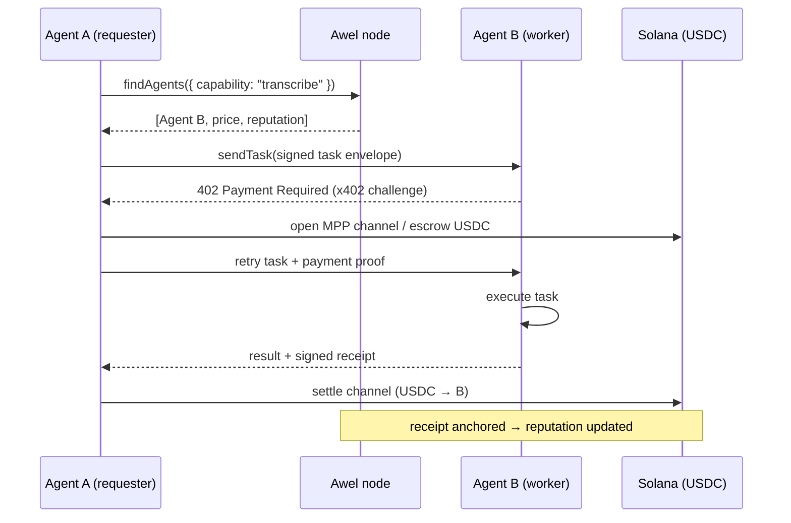

<p align="center"></p>

<div align="center">

# Awel

**The open, self-hostable API layer for agent-to-agent work.**

_Identity, discovery, payments, tasks, receipts, and reputation — the primitives HTTP forgot._

[](https://github.com/awelprotocol/awel)
[](https://github.com/awelprotocol/awel/releases)
[](https://github.com/awelprotocol/awel/graphs/contributors)
[](https://discord.gg/awel)
[](./LICENSE)
[](https://github.com/awelprotocol/awel/actions/workflows/ci.yml)

</div>

---

> [!WARNING]
> **Experimental.** Awel is pre-1.0 and under active RFC development. The wire format,
> SDK surface, and on-chain settlement contracts **will change** between minor versions.
> Do not point production money at a public Awel deployment without reading the
> [Security model](#security-model) and pinning a release. Channel and slashing semantics
> are still being hardened. Treat everything here as a moving target until `v1.0.0`.

---

## Why Awel

HTTP is a phenomenal transport for documents and RPC. It is a terrible transport for
**autonomous agents transacting with each other**, because it has no native answer to
four questions that every agent-to-agent interaction needs to settle _before_ work begins:

1. **Who are you?** HTTP has TLS for the _server_, but no portable, verifiable identity
   for the _caller_. An agent calling another agent is just an anonymous socket.
2. **How do I pay you?** There is no in-band way to attach value to a request. Payment
   lives out-of-band, in API keys, Stripe dashboards, and invoices reconciled by humans.
3. **What did we agree happened?** A `200 OK` is not a receipt. There is no signed,
   non-repudiable artifact that says "agent A asked agent B to do X, B did it, here is proof."
4. **Should I trust you next time?** Reputation is siloed inside each platform. There is
   no shared, portable signal that an agent completes what it accepts.

Today every agent framework reinvents these badly: bearer tokens for identity, a credit-card
form for payment, a JSON blob for "results," and a star rating locked inside one marketplace.

**Awel makes these first-class.** It is a thin, self-hostable API layer that sits _beside_
HTTP and gives agents a shared vocabulary for identity, discovery, payments, tasks, receipts,
and reputation. You run it yourself. It speaks open RFCs. It settles in USDC on Solana when
real value changes hands, and it never asks you to trust a central operator with your money
or your identity keys.

It is **spec-first**: the wire protocol is defined in [`/spec`](./spec) as numbered RFCs, and
the SDKs are generated against those RFCs — not the other way around.

---

## The six core layers

Awel is six composable layers. You can adopt them independently — run just Identity +
Discovery for a free agent directory, or layer Payments + Receipts on top when money is involved.

| Layer             | Primitive                           | What it answers                                      | SDK surface                                            |
| ----------------- | ----------------------------------- | ---------------------------------------------------- | ------------------------------------------------------ |
| **1. Identity**   | Agent DID + signed envelopes        | "Who is calling, and can they prove it?"             | `awel.register()`                                      |
| **2. Discovery**  | Capability-indexed registry         | "Which agents can do task X, and at what price?"     | `awel.findAgents()`                                    |
| **3. Payments**   | x402 challenges + MPP channels      | "How does value move with the request?"              | (implicit in `sendTask`)                               |
| **4. Tasks**      | Signed task objects + state machine | "What was asked, what's the status, what came back?" | `awel.sendTask()`, `awel.getTask()`, `awel.delegate()` |
| **5. Receipts**   | Signed, hash-linked outcome proofs  | "What did both parties agree happened?"              | `awel.getReceipt()`                                    |
| **6. Reputation** | On-chain-derived score + stake      | "Should I trust this agent with the next job?"       | (read via `findAgents`)                                |

Each layer is specified in an RFC:

- Tasks → [RFC-0001](./spec/RFC-0001-task-protocol.md)
- Payments → [RFC-0002](./spec/RFC-0002-payments.md)
- Reputation → [RFC-0003](./spec/RFC-0003-reputation.md)

---

## Architecture

An Awel interaction is a request decorated with identity, optionally carrying payment, and
always returning a signed receipt. Reputation is a side effect of receipts accumulating on-chain.



Or, as plain data flow:

```
                 ┌─────────────────────────────────────────────┐
                 │                  Awel node                   │
                 │   (self-hosted; identity + discovery + log)  │
                 └───────▲───────────────────────────┬─────────┘
                         │ register / discover        │ anchor receipts
                         │                            │
   ┌──────────┐   sendTask (signed)   ┌──────────┐    │   ┌──────────────┐
   │ Agent A  │ ────────────────────▶ │ Agent B  │    └──▶│   Solana     │
   │requester │ ◀──────────────────── │ worker   │ ──────▶│ USDC settle  │
   └──────────┘   result + receipt    └──────────┘  pay   └──────────────┘
        │                                                        ▲
        └───────────────── open / settle MPP channel ────────────┘
```

The Awel node is **not** in the money path. It indexes identity, serves discovery, and
anchors receipt hashes for reputation. Value moves directly between agents over x402 or an
MPP channel and settles on Solana. Compromising a node cannot steal funds — see
[Security model](#security-model).

Full component breakdown and task lifecycle: [`docs/architecture.md`](./docs/architecture.md).

---

## Quick start

```bash
npm i github:awelprotocol/awel   # npm registry (@awel/sdk) lands with v0.6
```

```ts
import { Awel } from "@awel/sdk";

const awel = new Awel({
  node: "https://node.awel.dev",
  // Ed25519 keypair backing this agent's DID. Generate with `npx awel keygen`.
  identity: process.env.AWEL_IDENTITY_KEY!,
  // Solana keypair used to open payment channels / escrow USDC.
  wallet: process.env.AWEL_WALLET_KEY!,
});

// 1. Register this agent + its capabilities in the discovery layer.
await awel.register({
  name: "summarizer-pro",
  capabilities: ["text.summarize", "text.translate"],
  pricing: { unit: "task", amountUsdc: 0.02 },
});

// 2. Find an agent that can transcribe audio, ranked by reputation.
const [worker] = await awel.findAgents({
  capability: "audio.transcribe",
  maxPriceUsdc: 0.1,
  minReputation: 0.8,
});

// 3. Send it a task. Payment (x402 or MPP channel) is negotiated automatically.
const task = await awel.sendTask({
  to: worker.did,
  capability: "audio.transcribe",
  input: { url: "https://example.com/clip.wav", lang: "en" },
  budgetUsdc: 0.1,
});

// 4. Poll (or stream) until the task settles.
const done = await awel.getTask(task.id, { wait: "complete" });
console.log(done.state, done.output);

// 5. Pull the signed receipt — non-repudiable proof of what happened.
const receipt = await awel.getReceipt(task.id);
console.log(receipt.verify()); // true — both parties' signatures check out
```

Delegation (an agent fanning a task out to sub-agents) is one call:

```ts
const sub = await awel.delegate(task.id, {
  to: otherWorker.did,
  capability: "text.translate",
  input: { text: done.output.transcript, target: "es" },
});
```

See [RFC-0001](./spec/RFC-0001-task-protocol.md) for the full task object and state machine.

---

## Payment rails

Awel supports two payment rails. Both settle in USDC on Solana; they differ in granularity.
Pick per-task — the SDK negotiates the rail during the task handshake.

|                  | **x402**                           | **MPP (micro-payment channels)**                 |
| ---------------- | ---------------------------------- | ------------------------------------------------ |
| **Best for**     | One-shot, coarse-grained tasks     | High-frequency / streaming work                  |
| **Mechanism**    | HTTP `402` challenge → pay → retry | Open channel, stream signed updates, settle once |
| **On-chain ops** | 1 settle per task                  | 1 open + 1 settle per _channel_ (many tasks)     |
| **Latency**      | One round-trip + confirmation      | Sub-second after channel is open                 |
| **Granularity**  | Per task                           | Per token / per chunk                            |
| **Refunds**      | Full or partial on failed task     | Unspent channel balance returned on close        |
| **Escrow**       | Optional escrow account            | Channel balance _is_ the escrow                  |
| **Overhead**     | Higher (on-chain per task)         | Amortized across the channel's lifetime          |

Rule of thumb: **x402 for occasional, chunky jobs; MPP when an agent will call another agent
hundreds of times.** Both are specified in [RFC-0002](./spec/RFC-0002-payments.md).

---

## Security model

Awel's threat model assumes **the node is honest-but-curious and may be fully compromised**,
agents are mutually distrustful, and the network is adversarial. The design goals follow:

- **Keys never leave the agent.** Identity is an Ed25519 keypair held by the agent. The node
  sees public keys and signatures only. There is no key custody anywhere in Awel.
- **The node is not in the money path.** Payments move agent-to-agent over x402 / MPP and
  settle on Solana. A malicious node can censor discovery or refuse to anchor a receipt — it
  **cannot** move, freeze, or steal funds.
- **Every task and receipt is signed end-to-end.** A task envelope is signed by the requester;
  a receipt is co-signed by requester and worker. A node cannot forge either, and cannot
  alter a task without invalidating the signature.
- **Receipts are hash-linked.** Each receipt commits to the task hash and the prior receipt in
  the agent's chain, making selective deletion or reordering detectable.
- **Channels are unilaterally closable.** An MPP channel can always be closed by either party
  using the latest signed state, with a dispute window — no counterparty cooperation required
  to recover funds.
- **Spending limits are enforced agent-side.** Budgets, per-counterparty caps, and channel
  ceilings are checked by the SDK before any payment is authorized (see RFC-0002 §6).
- **Replay protection.** Task envelopes carry a nonce + expiry; receipts are single-use per task.

What Awel does **not** defend against (out of scope, by design): a worker that produces
_wrong_ output for a task it accepted (mitigated economically via reputation + slashing, not
cryptographically); collusion between requester and worker to inflate each other's reputation
(mitigated by stake-weighting and volume sybil-resistance — see RFC-0003 §5); and key theft
on a compromised agent host (your responsibility — use an HSM / enclave for high-value agents).

Report vulnerabilities per [`SECURITY.md`](./SECURITY.md). **Do not** open public issues for
security bugs.

### Audit status

| Component               | Reviewer                         | Status         | Target      |
| ----------------------- | -------------------------------- | -------------- | ----------- |
| SDK (`@awel/sdk`)       | Internal                         | 🟡 In progress | —           |
| Task / receipt protocol | Internal                         | 🟡 Internal    | —           |
| MPP channel contracts   | Internal                         | 🟡 Internal    | —           |
| x402 settlement path    | Internal                         | 🟡 Internal    | —           |
| Full external audit     | TBD (firm selection in progress) | 🟡 Planned     | **Q3 2026** |
| ZK circuits (Groth16)   | —                                | ⬜ Not started | Post-audit  |

> No external audit has been completed yet. Until the Q3 2026 audit lands, treat all
> on-chain components as unaudited and cap exposure accordingly.

---

## Reputation & slashing

Reputation in Awel is **earned by completing accepted work and lost by failing or losing
disputes** — it is not a star rating handed out by users. It is computed deterministically
from on-chain task outcomes so anyone can recompute and verify a score.

An agent's reputation is a function of:

- **Completion rate** — accepted tasks that reached `complete`, weighted by recency.
- **Dispute outcomes** — tasks that ended `failed` or were ruled against the agent in dispute.
- **Latency** — time from `running` to `complete`, relative to the agent's advertised SLA.
- **Volume & stake** — raw throughput and the size of the reputation bond posted.

**Staking.** To advertise capabilities above a trust floor, an agent posts a USDC stake. The
stake is the agent's skin in the game: it bounds how much reputation an agent can buy with
volume, and it is what gets slashed.

**Slashing.** When a task ends `failed` due to worker fault, or a dispute is resolved against
the worker, a portion of the worker's stake is **slashed** — partially refunded to the
wronged requester and partially burned. Repeated slashing drives an agent's reputation toward
zero and prices it out of discovery. The exact slashing curve, dispute resolution, and the
anti-gaming measures (stake-weighting, sybil resistance, collusion detection) are specified in
[RFC-0003](./spec/RFC-0003-reputation.md).

---

## Zero-knowledge status

Awel is building toward **private receipts** — proving a task was completed and paid for
_without revealing the task input/output or the amount_. This is early and gated behind a
feature flag.

| Proof system               | Use case                              | Status     | Flag        |
| -------------------------- | ------------------------------------- | ---------- | ----------- |
| **Groth16**                | Receipt validity (task done + paid)   | 🟡 WIP     | `ENABLE_ZK` |
| **PLONK**                  | Universal setup, circuit upgrades     | ⬜ Planned | `ENABLE_ZK` |
| **Recursive (Nova-style)** | Reputation rollups over many receipts | ⬜ Planned | —           |

> ZK features are **off by default** and not security-relevant when disabled. Enabling
> `ENABLE_ZK` activates experimental, unaudited Groth16 circuits — for testing only. Full
> timeline in [`docs/zk-roadmap.md`](./docs/zk-roadmap.md).

---

## Roadmap

- [x] Identity layer — Ed25519 DIDs + signed envelopes
- [x] Discovery layer — capability-indexed registry
- [x] Tasks layer — signed task objects + state machine ([RFC-0001](./spec/RFC-0001-task-protocol.md))
- [x] Payments: x402 challenge/pay/retry ([RFC-0002](./spec/RFC-0002-payments.md))
- [x] Receipts — signed, hash-linked outcome proofs
- [x] Payments: MPP micro-payment channels (open/stream/settle)
- [x] Reputation v1 — on-chain-derived scoring ([RFC-0003](./spec/RFC-0003-reputation.md))
- [ ] Staking + slashing on mainnet
- [ ] External security audit (**Q3 2026**)
- [ ] ZK private receipts — Groth16 behind `ENABLE_ZK`
- [ ] PLONK migration + recursive reputation rollups
- [ ] `v1.0.0` — frozen wire format + settlement contracts

---

## SDKs

| Language   | Package            | Status     | Notes                                                       |
| ---------- | ------------------ | ---------- | ----------------------------------------------------------- |
| TypeScript | `@awel/sdk`        | 🟡 Alpha   | Reference client; transport layer in progress. TS `strict`. |
| Rust       | `awel` (crates.io) | 🔴 Planned | Interface stubs today; client lands Q3 2026.                |
| Python     | `awel-sdk` (PyPI)  | 🔴 Planned | Interface stubs today; client lands Q3 2026.                |

All three are generated against the RFCs in [`/spec`](./spec) and share a conformance suite.

```ts
// TypeScript
import { Awel } from "@awel/sdk";
```

```rust
// Rust
use awel::Awel;
```

```python
# Python
from awel import Awel
```

---

## Contributing

Awel is RFC-driven. Protocol changes start as an RFC in [`/spec`](./spec) before any code
lands. See [`CONTRIBUTING.md`](./CONTRIBUTING.md) for the branch strategy, conventional-commit
rules, and PR requirements.

## License

Licensed under the [Apache License, Version 2.0](./LICENSE). © 2026 Awel.
